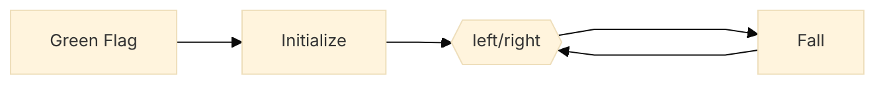
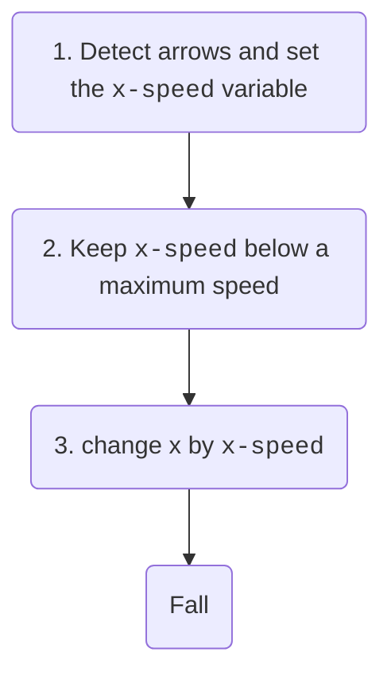

---
{"dg-publish":true,"permalink":"/digital-garden/hatlight-platformer/"}
---


# Hatlight Platformer

As always, start by creating your **main sprite** and initializing your **variables**. 

- In this case, it is important that **your main sprite is just a square**. Later, we will make it have a real costume, but for now, just a square.
- Initialize usually means things like **position**, **direction**, and **effects**.
- You will also initialize all your **variables**. 
- At the start you don't always know all your variables, but as this is a platformer, we know we will need `x speed `and `y speed`, so let's initialize those.
- To set the **position**, use this trick: Put your sprite at the starting position in the stage. Then the `go to x` block amd scratch will put the correct numbers in the block.

This is what we get:

```ad-scratch
title: main sprite
~~~scratchblock

when @greenFlag clicked
broadcast [initialize v]


when I receive [initialize v]
set [ghost v] effect to (0)::looks
go to x: (-205) y: (65)
set [x speed v] to [0]
set [y speed v] to [0]
~~~
```


After we initialize, we move left right, then fall, then repeat. The flowchart for this is:



The hexagon means that left/right is the start of a loop. In this case the loop goes forever.

So, let's put in  left/right and fall stacks.

```ad-scratch
title: main sprite
~~~scratchblock
when @greenFlag clicked
   broadcast [initialize v]
   broadcast [move left / right v]


when I receive [move left / right v]
our left right routine will go here
broadcast [fall v]


when I receive [fall v]
our fall routine goes here
broadcast [move left / right v]

~~~
```


So let's do the left right routine. The basic routine is this:



```ad-scratch
title: main sprite
~~~scratchblock
when I receive [move left / right v]
set xspeed::custom
keep speed below max::custom
change x by (x speed)
broadcast [fall v]
~~~
```


Changing the speed is now easy. If no key is being held, then slow the speed down. Otherwise, speed  up in the direction we are going.

```ad-scratch
title: 
~~~scratchblock

define set xspeed
if <<not <key [left arrow v] pressed?>> and <not <key [right arrow v] pressed?>>> then
   no key is being pressed so we decrease speed
   if moving left, go a little less left, if going right, go a little less right.
   if moving left, make xspeed bigger, if going right, make xspeed smaller
   moving left +1 right -1
   moving left means speed IS LESS THAN 0,  right means speed IS MORE THAN 0
   change [x speed v] by (<(x speed) \< [0]> - <(x speed) \> [0]>)
else
    /: [else go in direction of arrow]::custom
    change [x speed v] by (<key [right arrow v] pressed?> - <key [left arrow v] pressed?>)
end


~~~
```

Keeping the speed below the max is easy, but we have to remember that left and right are different.
```ad-scratch
title: 
~~~scratchblock


define keep speed below max
/: [set maximum speed]::custom
moving right:
if <(x speed) \> [4]> then
    set [x speed v] to [4]
end
moving left:
if <(x speed) \< [-4]> then
    set [x speed v] to [-4]
end
~~~
```


To be continued....

- Make a platform/wall sprite
- add fall routine
