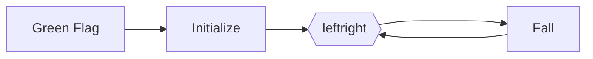
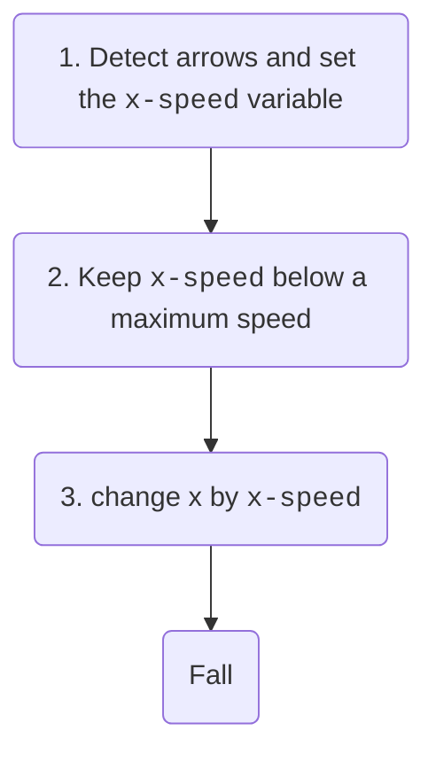
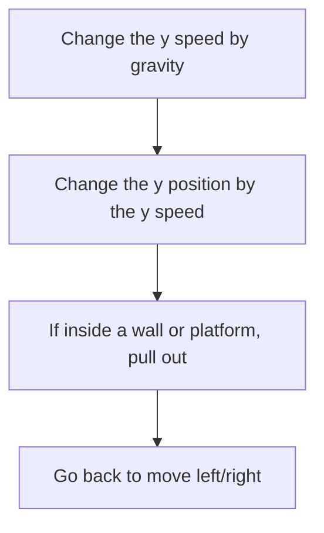

---
{"dg-publish":true,"permalink":"/digital-garden/hatlight-platformer/"}
---


# Hatlight Platformer

As always, start by creating your **main sprite** and initializing your **variables**. 

- In this case, it is important that **your main sprite is just a square**. Later, we will make it have a real costume, but for now, just a square.
- Initialize usually means things like **position**, **direction**, and **effects**.
- You will also initialize all your **variables**. 
- At the start you don't always know all your variables, but as this is a platformer, we know we will need `x speed `and `y speed`, so let's initialize those.
- To set the **position**, use this trick: Put your sprite at the starting position in the stage. Then the `go to x` block amd scratch will put the correct numbers in the block.

This is what we get:

```ad-scratch
title: main sprite
~~~scratchblock

when @greenFlag clicked
broadcast [initialize v]


when I receive [initialize v]
set [ghost v] effect to (0)::looks
go to x: (-205) y: (65)
set [x speed v] to [0]
set [y speed v] to [0]
~~~
```


After we initialize, we move left right, then fall, then repeat. The flowchart for this is:



<style>
.container {font-family: sans-serif; text-align: center;}
.button-wrapper button {z-index: 1;height: 40px; width: 100px; margin: 10px;padding: 5px;}
.excalidraw .App-menu_top .buttonList { display: flex;}
.excalidraw-wrapper { height: 800px; margin: 50px; position: relative;}
:root[dir="ltr"] .excalidraw .layer-ui__wrapper .zen-mode-transition.App-menu_bottom--transition-left {transform: none;}
</style><script src="https://unpkg.com/react@17/umd/react.production.min.js"></script><script src="https://unpkg.com/react-dom@17/umd/react-dom.production.min.js"></script><script type="text/javascript" src="https://unpkg.com/@excalidraw/excalidraw@0.12.0/dist/excalidraw.production.min.js"></script><div id="Drawing_2022-11-19_0532.43.excalidraw.md1"></div><script>(function(){const InitialData={"type":"excalidraw","version":2,"source":"https://excalidraw.com","elements":[{"id":"kIpcIyXL3ooJLEcxmnuFo","type":"rectangle","x":-108.76226806640625,"y":-329.4993896484375,"width":197,"height":110,"angle":0,"strokeColor":"#000000","backgroundColor":"transparent","fillStyle":"hachure","strokeWidth":1,"strokeStyle":"solid","roughness":1,"opacity":100,"groupIds":[],"strokeSharpness":"sharp","seed":215930929,"version":68,"versionNonce":966119025,"isDeleted":false,"boundElements":[{"type":"text","id":"D0DGzSVd"},{"id":"ZORZ5LNeCVJnlc_FTpLEz","type":"arrow"}],"updated":1668803654497,"link":null,"locked":false},{"id":"D0DGzSVd","type":"text","x":-64.26226806640625,"y":-286.9993896484375,"width":108,"height":25,"angle":0,"strokeColor":"#000000","backgroundColor":"transparent","fillStyle":"hachure","strokeWidth":1,"strokeStyle":"solid","roughness":1,"opacity":100,"groupIds":[],"strokeSharpness":"sharp","seed":931231377,"version":20,"versionNonce":1102959153,"isDeleted":false,"boundElements":null,"updated":1668803593267,"link":null,"locked":false,"text":"Green Flag","rawText":"Green Flag","fontSize":20,"fontFamily":1,"textAlign":"center","verticalAlign":"middle","baseline":18,"containerId":"kIpcIyXL3ooJLEcxmnuFo","originalText":"Green Flag"},{"type":"rectangle","version":89,"versionNonce":296162271,"isDeleted":false,"id":"bJb0fj-pMsTiNzWyyCe3r","fillStyle":"hachure","strokeWidth":1,"strokeStyle":"solid","roughness":1,"opacity":100,"angle":0,"x":-108.1712646484375,"y":-118.23095703125,"strokeColor":"#000000","backgroundColor":"transparent","width":197,"height":110,"seed":1157542321,"groupIds":[],"strokeSharpness":"sharp","boundElements":[{"id":"s7YmvQdn","type":"text"},{"id":"ZORZ5LNeCVJnlc_FTpLEz","type":"arrow"},{"id":"FwbYRkFkV6xyNh40BDf9i","type":"arrow"}],"updated":1668803663154,"link":null,"locked":false},{"type":"text","version":51,"versionNonce":1747224049,"isDeleted":false,"id":"s7YmvQdn","fillStyle":"hachure","strokeWidth":1,"strokeStyle":"solid","roughness":1,"opacity":100,"angle":0,"x":-53.6712646484375,"y":-75.73095703125,"strokeColor":"#000000","backgroundColor":"transparent","width":88,"height":25,"seed":2055164817,"groupIds":[],"strokeSharpness":"sharp","boundElements":[],"updated":1668803658092,"link":null,"locked":false,"fontSize":20,"fontFamily":1,"text":"Initialize","rawText":"Initialize","baseline":18,"textAlign":"center","verticalAlign":"middle","containerId":"bJb0fj-pMsTiNzWyyCe3r","originalText":"Initialize"},{"id":"EBzRlL4BM_kycvhUHpqo2","type":"rectangle","x":-58.9512939453125,"y":109.87042236328125,"width":0.81396484375,"height":0.2034912109375,"angle":0,"strokeColor":"#000000","backgroundColor":"transparent","fillStyle":"hachure","strokeWidth":1,"strokeStyle":"solid","roughness":1,"opacity":100,"groupIds":[],"strokeSharpness":"sharp","seed":722700095,"version":4,"versionNonce":1823711761,"isDeleted":false,"boundElements":null,"updated":1668803616446,"link":null,"locked":false},{"type":"rectangle","version":118,"versionNonce":1737517407,"isDeleted":false,"id":"NGz-Xi97KNeD1MixKyo4e","fillStyle":"hachure","strokeWidth":1,"strokeStyle":"solid","roughness":1,"opacity":100,"angle":0,"x":-114.1981201171875,"y":66.16748046875,"strokeColor":"#000000","backgroundColor":"transparent","width":197,"height":110,"seed":593232767,"groupIds":[],"strokeSharpness":"sharp","boundElements":[{"id":"1wO14ku0","type":"text"},{"id":"FwbYRkFkV6xyNh40BDf9i","type":"arrow"},{"id":"XKLKx2-79rcR8wXGa1IG6","type":"arrow"},{"id":"Uw1T9L_Yr_-EL7cQbcYSN","type":"arrow"}],"updated":1668803680227,"link":null,"locked":false},{"type":"text","version":88,"versionNonce":569203537,"isDeleted":false,"id":"1wO14ku0","fillStyle":"hachure","strokeWidth":1,"strokeStyle":"solid","roughness":1,"opacity":100,"angle":0,"x":-65.1981201171875,"y":108.66748046875,"strokeColor":"#000000","backgroundColor":"transparent","width":99,"height":25,"seed":1391933425,"groupIds":[],"strokeSharpness":"sharp","boundElements":[],"updated":1668803624046,"link":null,"locked":false,"fontSize":20,"fontFamily":1,"text":"left/Right","rawText":"left/Right","baseline":18,"textAlign":"center","verticalAlign":"middle","containerId":"NGz-Xi97KNeD1MixKyo4e","originalText":"left/Right"},{"type":"rectangle","version":185,"versionNonce":1610737983,"isDeleted":false,"id":"z9zngZHvXag7DYg_akr2Z","fillStyle":"hachure","strokeWidth":1,"strokeStyle":"solid","roughness":1,"opacity":100,"angle":0,"x":-120.8941650390625,"y":278.5950927734375,"strokeColor":"#000000","backgroundColor":"transparent","width":197,"height":110,"seed":1126680881,"groupIds":[],"strokeSharpness":"sharp","boundElements":[{"id":"KM39gTii","type":"text"},{"id":"Uw1T9L_Yr_-EL7cQbcYSN","type":"arrow"}],"updated":1668803680227,"link":null,"locked":false},{"type":"text","version":164,"versionNonce":1464533457,"isDeleted":false,"id":"KM39gTii","fillStyle":"hachure","strokeWidth":1,"strokeStyle":"solid","roughness":1,"opacity":100,"angle":0,"x":-41.3941650390625,"y":321.0950927734375,"strokeColor":"#000000","backgroundColor":"transparent","width":38,"height":25,"seed":989421151,"groupIds":[],"strokeSharpness":"sharp","boundElements":[],"updated":1668803639321,"link":null,"locked":false,"fontSize":20,"fontFamily":1,"text":"Fall","rawText":"Fall","baseline":18,"textAlign":"center","verticalAlign":"middle","containerId":"z9zngZHvXag7DYg_akr2Z","originalText":"Fall"},{"id":"ZORZ5LNeCVJnlc_FTpLEz","type":"arrow","x":-7.917744228236874,"y":-214.35595703125,"width":7.190697332799008,"height":91.978759765625,"angle":0,"strokeColor":"#000000","backgroundColor":"transparent","fillStyle":"hachure","strokeWidth":1,"strokeStyle":"solid","roughness":1,"opacity":100,"groupIds":[],"strokeSharpness":"round","seed":1480294335,"version":497,"versionNonce":442539985,"isDeleted":false,"boundElements":null,"updated":1668803658092,"link":null,"locked":false,"points":[[0,0],[7.190697332799008,91.978759765625]],"lastCommittedPoint":[-0.9246826171875,110.86685180664062],"startBinding":{"elementId":"kIpcIyXL3ooJLEcxmnuFo","focus":0.02548786858756113,"gap":5.1434326171875},"endBinding":{"elementId":"bJb0fj-pMsTiNzWyyCe3r","focus":0.13198608950771287,"gap":4.146240234375},"startArrowhead":null,"endArrowhead":"arrow"},{"id":"FwbYRkFkV6xyNh40BDf9i","type":"arrow","x":-2.7047119140625,"y":-5.7154541015625,"width":0.9588623046875,"height":68.02923583984375,"angle":0,"strokeColor":"#000000","backgroundColor":"transparent","fillStyle":"hachure","strokeWidth":1,"strokeStyle":"solid","roughness":1,"opacity":100,"groupIds":[],"strokeSharpness":"round","seed":827769279,"version":35,"versionNonce":250338705,"isDeleted":false,"boundElements":null,"updated":1668803663154,"link":null,"locked":false,"points":[[0,0],[0.9588623046875,68.02923583984375]],"lastCommittedPoint":null,"startBinding":{"elementId":"bJb0fj-pMsTiNzWyyCe3r","focus":-0.06200822485623379,"gap":2.5155029296875},"endBinding":{"elementId":"NGz-Xi97KNeD1MixKyo4e","focus":0.1488972310255536,"gap":3.85369873046875},"startArrowhead":null,"endArrowhead":"arrow"},{"id":"XKLKx2-79rcR8wXGa1IG6","type":"arrow","x":-10.07958984375,"y":177.05615234375,"width":4.196044921875,"height":103.912841796875,"angle":0,"strokeColor":"#000000","backgroundColor":"transparent","fillStyle":"hachure","strokeWidth":1,"strokeStyle":"solid","roughness":1,"opacity":100,"groupIds":[],"strokeSharpness":"round","seed":161219441,"version":40,"versionNonce":929262207,"isDeleted":false,"boundElements":null,"updated":1668803668362,"link":null,"locked":false,"points":[[0,0],[-4.196044921875,103.912841796875]],"lastCommittedPoint":null,"startBinding":{"elementId":"NGz-Xi97KNeD1MixKyo4e","focus":-0.07818969917462053,"gap":1},"endBinding":null,"startArrowhead":null,"endArrowhead":"arrow"},{"id":"Uw1T9L_Yr_-EL7cQbcYSN","type":"arrow","x":-17.2205810546875,"y":390.6990966796875,"width":211.36083099310449,"height":350.04327392578125,"angle":0,"strokeColor":"#000000","backgroundColor":"transparent","fillStyle":"hachure","strokeWidth":1,"strokeStyle":"solid","roughness":1,"opacity":100,"groupIds":[],"strokeSharpness":"round","seed":1907344031,"version":598,"versionNonce":1288532529,"isDeleted":false,"boundElements":null,"updated":1668803711436,"link":null,"locked":false,"points":[[0,0],[53.81353759765625,82.94061279296875],[194.26472774120984,79.42782500083632],[207.78117688840004,-73.92901179786645],[211.36083099310449,-243.52506324313634],[104.1495361328125,-267.1026611328125]],"lastCommittedPoint":null,"startBinding":{"elementId":"z9zngZHvXag7DYg_akr2Z","focus":0.2375572304060523,"gap":2.10400390625},"endBinding":{"elementId":"NGz-Xi97KNeD1MixKyo4e","focus":-0.2627186585096104,"gap":4.1270751953125},"startArrowhead":null,"endArrowhead":"arrow"}],"appState":{"theme":"light","viewBackgroundColor":"#ffffff","currentItemStrokeColor":"#000000","currentItemBackgroundColor":"transparent","currentItemFillStyle":"hachure","currentItemStrokeWidth":1,"currentItemStrokeStyle":"solid","currentItemRoughness":1,"currentItemOpacity":100,"currentItemFontFamily":1,"currentItemFontSize":20,"currentItemTextAlign":"left","currentItemStrokeSharpness":"sharp","currentItemStartArrowhead":null,"currentItemEndArrowhead":"arrow","currentItemLinearStrokeSharpness":"round","gridSize":null,"colorPalette":{}},"files":{}};InitialData.scrollToContent=true;App=()=>{const e=React.useRef(null),t=React.useRef(null),[n,i]=React.useState({width:void 0,height:void 0});return React.useEffect(()=>{i({width:t.current.getBoundingClientRect().width,height:t.current.getBoundingClientRect().height});const e=()=>{i({width:t.current.getBoundingClientRect().width,height:t.current.getBoundingClientRect().height})};return window.addEventListener("resize",e),()=>window.removeEventListener("resize",e)},[t]),React.createElement(React.Fragment,null,React.createElement("div",{className:"excalidraw-wrapper",ref:t},React.createElement(ExcalidrawLib.Excalidraw,{ref:e,width:n.width,height:n.height,initialData:InitialData,viewModeEnabled:!0,zenModeEnabled:!0,gridModeEnabled:!1})))},excalidrawWrapper=document.getElementById("Drawing_2022-11-19_0532.43.excalidraw.md1");ReactDOM.render(React.createElement(App),excalidrawWrapper);})();</script>

The hexagon means that left/right is the start of a loop. In this case the loop goes forever.

So, let's put in  left/right and fall stacks.

```ad-scratch
title: main sprite
~~~scratchblock
when @greenFlag clicked
   broadcast [initialize v]
   broadcast [move left / right v]


when I receive [move left / right v]
our left right routine will go here
broadcast [fall v]


when I receive [fall v]
our fall routine goes here
broadcast [move left / right v]

~~~
```


So let's do the left right routine. The basic routine is this:



```ad-scratch
title: main sprite
~~~scratchblock
when I receive [move left / right v]
set xspeed::custom
keep speed below max::custom
change x by (x speed)
broadcast [fall v]
~~~
```


Changing the speed is now easy. If no key is being held, then slow the speed down. Otherwise, speed  up in the direction we are going.

```ad-scratch
title: 
~~~scratchblock

define set xspeed
if <<not <key [left arrow v] pressed?>> and <not <key [right arrow v] pressed?>>> then
   no key is being pressed so we decrease speed
   if moving left, go a little less left, if going right, go a little less right.
   if moving left, make xspeed bigger, if going right, make xspeed smaller
   moving left +1 right -1
   moving left means speed IS LESS THAN 0,  right means speed IS MORE THAN 0
   change [x speed v] by (<(x speed) \< [0]> - <(x speed) \> [0]>)
else
    /: [else go in direction of arrow]::custom
    change [x speed v] by (<key [right arrow v] pressed?> - <key [left arrow v] pressed?>)
end


~~~
```

Keeping the speed below the max is easy, but we have to remember that left and right are different.
```ad-scratch
title: 
~~~scratchblock


define keep speed below max
/: [set maximum speed]::custom
moving right:
if <(x speed) \> [4]> then
    set [x speed v] to [4]
end
moving left:
if <(x speed) \< [-4]> then
    set [x speed v] to [-4]
end
~~~
```

# Falling

Next we will teach our guy to fall. First, we need a platform or wall for the character to fall onto. So make one. 

Our basic fall routine is 




We could change the y position by y speed in big jumps, but it might turn out we will jump beyond the platform, so instead we will change y by 1 step y-speed times. 


```ad-scratch
title: 
~~~scratchblock

when I receive [fall v]
change [y speed v] by (-1)
change y  by 1 (y speed) times or until touching wall::custom
/: [At this point we may be touching a wall]::custom
/: [if so, we should pull out of the wall]::custom
/: [our speed +/- tells us whether we are either moving up (ceiling\) or down (floor\)]::custom
pull up or down if touching walls depending on whether we were <(y speed) \> [0]> or not::custom
broadcast [move left / right v]

~~~
```


To be continued...
